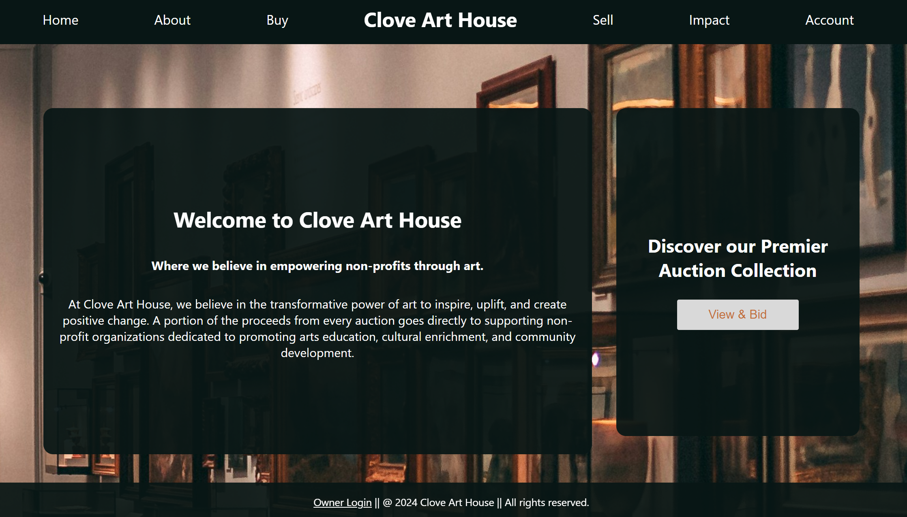

# Clove Art House
    At Clove Art House, our mission goes beyond transactions. We're passionate about spreading artists' names far and wide. We amplify their voices helping to create a world where every artist's voice is heard and cherished. Join us in our journey to celebrate art, creativity, and the human spirit, knowing that every purchase supports our partnered nonprofits, furthering our commitment to the artistic community and important causes.

## Table of Contents
1. [Technologies Used](#technologies-used)
2. [Installation & Usage](#installation-and-usage)
3. [Collaborators](#collaborators)

## Features

1. **Auction System**: Allows users to place bids on items displayed on the website.

2. **Real-time Updates**: Utilizes Socket.IO for real-time communication, ensuring that bid prices are updated instantly for all users without needing to refresh the page.

3. **User Authentication**: Tracks user login status (`isLoggedIn` state) and prompts users to log in before they can place a bid.

4. **Product Display**: Displays product details including title, description, and image.

5. **Responsive Design**: Styled using CSS, indicating attention to user interface design and possibly responsive layout for different screen sizes.

6. **Error Handling**: Basic error handling included to ensure bid amounts are valid and greater than the current price.

7. **Scalability**: Utilizes Socket.IO for real-time updates, potentially making the website scalable to support a large number of concurrent users participating in auctions simultaneously.

8. **Virtual DOM**: Efficient rendering with React.

### Installation & Usage
This is a web based application and is accesiable at the link below. 

1. Access the deployed website at [https://art-auction-ea7c69280ad5.herokuapp.com/](https://art-auction-ea7c69280ad5.herokuapp.com/).

## Collaborators:
- [Juniper Wren McGill](https://github.com/JuniperWrenMcGill): Full Stack
- [Chad Andari](https://github.com/CodeClass0): SocketIO, Contributed to backend infrastucture 
- [Joseph Vanzandt](https://github.com/JosephVz): Database, Contributed to file infrastructure 